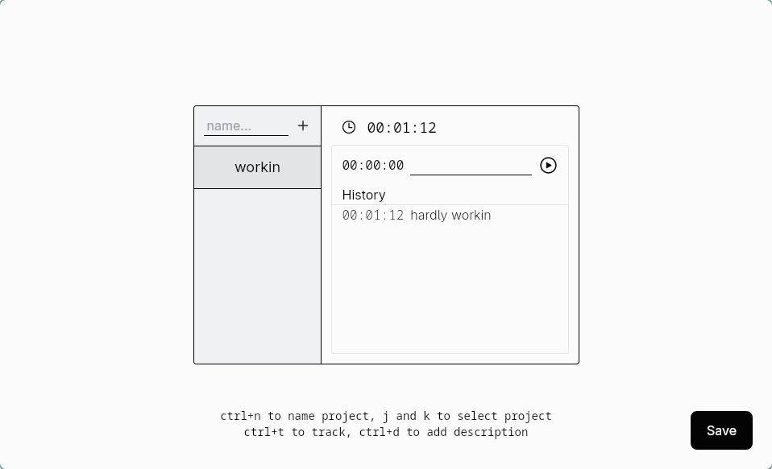

# sometimes
Web app to measure time :). Works on linux.


## How run
First clone this repo.
A script will install the python requirements and the packages needed to run this. You will need python ofc, `npm` and `npx`.
Then make the script executable
```
chmod +x localSetup.sh
```
And run it
```
./localSetup.ch
```

## How to build
First clone this repo.
Then install some libraries
```
npm install
```

Then build the app with tauri, this takes a lot of time...

```
npm run build:all
```

The app will be in `src-tauri/target/release/app`
You can run it with 

```
./src-tauri/target/release/app
```

## If your are not on linux
You could run the frontend with
```
npm install
npm run build
npx --yes serve -s dist
```
Then the backend
```
python3 -m venv venv 
source venv/bin/activate
pip install --upgrade pip 
pip install fastapi psutil uvicorn 
python main.py
```